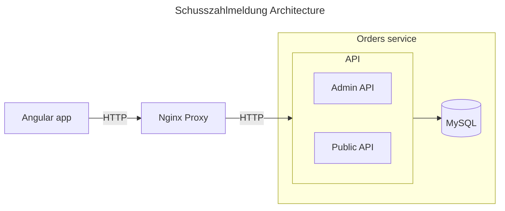
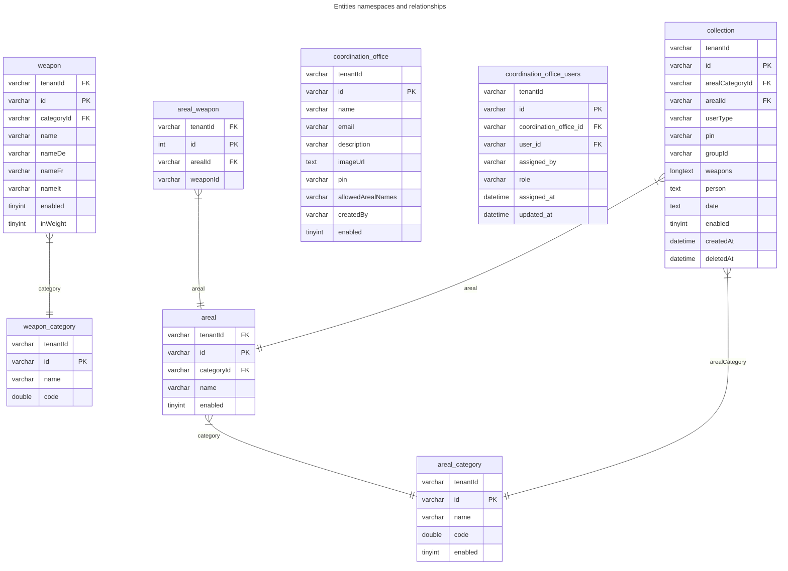

# ELO Schusszahlmeldung / Digital Shooting Logs

This repository powers the modernization of the Swiss Army’s shooting range system, built as a Progressive Web App (PWA) to replace manual, paper-based score reporting.

## It contains:

- Enable recruits to submit shooting data digitally and effortlessly
- Provide administrators with intuitive dashboards for real-time oversight and detailed reports
- Use a robust tech stack: **NestJS**, **TypeORM (MySQL)**, **Angular**, and **Nx** for structured, scalable development
- Ensure security, efficiency, and accuracy in a production-grade military environment
- Seamlessly orchestrate deployment with and without containerization (e.g., bare-metal setups or Docker/Kubernetes)

## Description
The ELO Schusszahlmeldung project modernizes the Swiss Army’s shooting range management system. It introduces a custom-built Progressive Web App (PWA) that allows recruits to digitally report their shooting scores, replacing paper-based processes. The application provides administrators with real-time oversight, detailed reporting, and efficient management tools.
Built with NestJS, Angular, TypeORM, and NX, the system ensures scalability, security, and user-friendliness. This digital transformation significantly improves accuracy, efficiency, and the overall shooting range experience.


### User Story Public

```mermaid
journey
  title Collection Entry (Public)
  section Tenant Selection
    Choose tenant: 5: User
  section Login / Personal Info
    Enter name, PIN, responsible, unit: 4: User
    Validate PIN via API: 3: System
  section Date & Location
    Select shooting range & area: 4: User
    Pick date & time slots: 3: User
    Load available areas: 3: System
  section Ammunition & Weapons
    Add weapons & quantities: 4: User
    Load weapons by area: 3: System
    Validate at least one weapon: 3: System
  section Summary
    Review all entries: 5: User
    Submit collection entry: 4: User
    Create collection via API: 3: System
  section Success
    Show success screen: 5: System
    Option to start new entry: 3: User
````

### User Story Admin
```mermaid
journey
  title (Admin)
  section Coordination Offices
    View/search Coords: 4: Admin
    Create/edit coords with PIN/email: 4: Admin
    Enable/disable coords: 3: Admin
  section Shooting Ranges (Areals)
    Browse categories & areals: 4: Admin
    Create/edit category or areal: 4: Admin
    Bulk-edit areals: 3: Admin
    Enable/disable areal: 3: Admin
  section Weapons
    Browse weapon categories: 4: Admin
    Create/edit category or weapon: 4: Admin
    Bulk-edit weapons: 3: Admin
    Enable/disable weapon: 3: Admin
  section Collections
    View list of collections: 5: Admin
    Filter/search collections: 4: Admin
    Create/edit collection manually: 4: Admin
  section Links & Relations
    Define allowed areals per coords: 3: Admin
    Link weapons to areals: 3: Admin
    Validate data for Wizard usage: 4: System
  section Bookmarks
    Manage user bookmarks & favorites: 3: Admin
```

### Architecture



### Entity - UML
Auto Generated in config/uml


----

### Configurations
| Category  | Path  |
|-----------|-------|
| **Env**   | `.env` |
| **Docker** | `config/docker` |
| **Swagger** | `config/swagger (generated)` |

----

### Preparation

Copy ``.env.example`` to `.env`

----
### Getting started | Setup

**With Docker:**

Run Docker:
``docker-compose -f ./config/docker/docker-compose.yml up``


**Without Docker:**


**Running:**
Run specific Application:
``npx nx serve [APPNAME]``

Run ui Applications:
`` npx nx run-many -t=serve -p=app*``

Run api Applications:
`` npx nx run-many -t=serve -p=api*``

**Test:**

Run ui Tests:
`` npx nx run-many -t=test -p=app*``

Run api Tests:
`` npx nx run-many -t=test -p=api*``

----

### Tools

| Name        | Path | Example              |
|-------------|------|----------------------|
| **swagger** | `tools/swagger.generator.js` | `npm run ng-swagger` |

