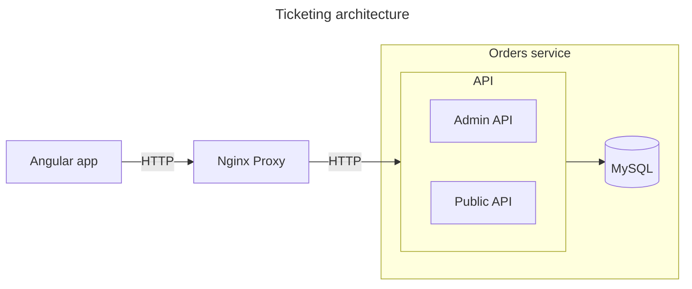

# ELO Schusszahlmeldung

The ELO Schusszahlmeldung project modernizes the Swiss Army’s shooting range management system. It introduces a custom-built Progressive Web App (PWA) that allows recruits to digitally report their shooting scores, replacing paper-based processes. The application provides administrators with real-time oversight, detailed reporting, and efficient management tools. Built with NestJS, Angular, TypeORM, and NX, the system ensures scalability, security, and user-friendliness. This digital transformation significantly improves accuracy, efficiency, and the overall shooting range experience.

### Architecture

### Entity - UML

----

### Configurations
| Category  | Path  |
|-----------|-------|
| **Env**   | `.env` |
| **Docker** | `config/docker` |
| **Swagger** | `config/swagger (generated)` |

----

### Preparation

Copy ``.env.example`` to `.env`

----
### Getting started | Setup

**With Docker:**

Run Docker:
``docker-compose -f ./config/docker/docker-compose.yml up``

**Without Docker:**

**Running:**
Run specific Application:
``npx nx serve [APPNAME]``

Run ui Applications:
`` npx nx run-many -t=serve -p=app*``

Run api Applications:
`` npx nx run-many -t=serve -p=api*``

**Test:**

Run ui Tests:
`` npx nx run-many -t=test -p=app*``

Run api Tests:
`` npx nx run-many -t=test -p=api*``

----

### Tools

| Name        | Path | Example              |
|-------------|------|----------------------|
| **swagger** | `tools/swagger.generator.js` | `npm run ng-swagger` |

